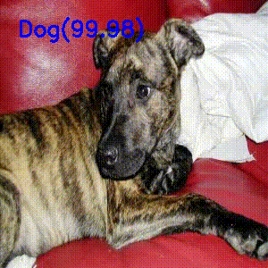

# Cats vs Dogs Image Classification using Transfer Learning (MobileNetV2)


<p align="center">
  
</p>

## Project Overview

This project classifies images as either **Cat** or **Dog** using **Transfer Learning** with MobileNetV2. The pretrained MobileNetV2 model is used as a feature extractor, while a custom classification layer is trained on the Cats vs Dogs dataset.

## Features

- Binary Image Classification
- Transfer Learning using MobileNetV2
- TensorFlow/Keras Implementation
- Predicts Cats and Dogs from unseen images
- Test Accuracy: **98.11%**

## Technologies Used

- Python
- TensorFlow
- Keras
- NumPy
- KaggleHub

## Dataset

**Dataset:** Cats vs Dogs

Downloaded using KaggleHub.

## Model Architecture

```
Input Image (224 × 224)
        │
        ▼
MobileNetV2 (Pretrained on ImageNet)
        │
        ▼
Dense Layer (Softmax)
        │
        ▼
Prediction (Cat / Dog)
```

## Results

| Metric | Value |
|--------|-------|
| Test Accuracy | **98.11%** |

## Project Structure

```text
cats-vs-dogs-transfer-learning/
│
├── README.md
├── train.py
├── predict.py
├── requirements.txt
├── model/
│   └── dogs_vs_cats.keras
└── sample_images/
```

## Installation

```bash
git clone <repository-url>
cd cats-vs-dogs-transfer-learning
pip install -r requirements.txt
```

## Training

```bash
python train.py
```

## Prediction

```bash
python predict.py sample_images/cat.jpg
```

## Future Improvements

- Fine-tune the pretrained MobileNetV2 layers.
- Compare performance with EfficientNetB0 and ResNet50.
- Build a Streamlit web application.
- Deploy the model online.

## License

This project is intended for educational purposes.
