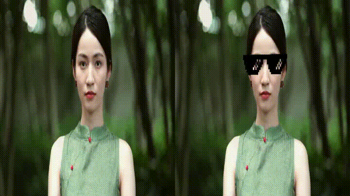

# 🎭 FaceFilterAR


Real-time augmented reality face filters built using **OpenCV**, **NumPy**, and **MediaPipe Face Mesh**.


FaceFilterAR detects facial landmarks in real time and automatically scales, rotates, and positions PNG overlays such as glasses, hats, masks, and beards onto a user's face.


---


## ✨ Features


* 👓 Glasses Filters

* 🧔 Beard Filters

* 👨 Mustache Filters

* 😷 Face Masks

* 👑 Crowns

* 🎩 Hats

* 🐰 Bunny Ears

* 👹 Devil Horns

* 😇 Halo

* 🏴‍☠️ Pirate Hat

* 🎪 Clown Nose

* 🎯 Automatic Face Tracking

* 🔄 Real-Time Rotation Alignment

* 📏 Dynamic Scaling
* 🎥 Webcam Support


---


## 🛠️ Technologies Used


* Python 3

* OpenCV

* MediaPipe Face Mesh

* NumPy


---


## 📂 Project Structure


```text

FaceFilterAR/

│

├── assets/

│   ├── glasses.png

│   ├── hat.png

│   ├── beard.png

│   ├── crown.png

│   └── ...

│

├── face_filter_engine.py

├── main.py

├── requirements.txt

└── README.md

```


---


## ⚙️ Installation


### Clone the Repository


```bash

git clone https://github.com/your-username/FaceFilterAR.git

cd FaceFilterAR

```


### Install Dependencies


```bash

pip install -r requirements.txt

```


---


## 🚀 Usage


Run the application:


```bash

python main.py

```


The webcam will open and the selected face filter will automatically follow your face in real time.


---


## 🧠 How It Works


1. MediaPipe Face Mesh detects 468 facial landmarks.

2. Key facial anchor points are selected.

3. Overlay images are scaled based on face width.

4. Overlay images are rotated to match head orientation.

5. The transformed overlay is blended onto the webcam frame.


---


## 🎯 Supported Filters


| Filter      | Facial Anchors |

| ----------- | -------------- |

| Glasses     | Eyes           |

| Mustache    | Mouth          |

| Beard       | Jaw            |

| Mask        | Face Width     |

| Crown       | Forehead       |

| Hat         | Forehead       |

| Bunny Ears  | Forehead       |

| Devil Horns | Forehead       |

| Halo        | Forehead       |

| Pirate Hat  | Forehead       |

| Clown Nose  | Nose           |


---


## 📸 Demo


Add screenshots or GIFs here:


```md



```


Example:


```md


```


---


## 📈 Future Improvements


* Multiple face support

* Animated filters

* Filter switching with keyboard shortcuts

* Gesture-controlled filters


---


## 🤝 Contributing


Contributions, bug reports, and feature requests are welcome.


Feel free to fork the repository and submit a pull request.


---


## 📜 License


This project is licensed under the MIT License.


---


## 👨‍💻 Author


Developed by **Saksham Mahajan**


If you found this project useful, consider giving it a ⭐ on GitHub.
